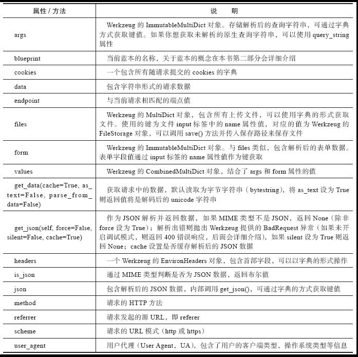
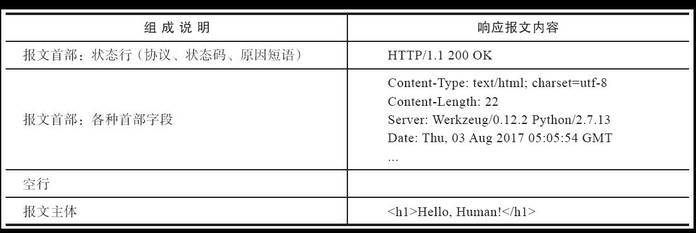

HTTP -- Hypertext Transfer Protocol 超文本传输协议

## 2.1 请求响应循环

* Request-Response Cycle

  

* Flask Web 程序工作流程

  


## 2.2 HTTP请求

* 以这个URL为例：https://helloflask.com/hello/?name=Grey

  | 信息              | 说明                                           |
  | ----------------- | ---------------------------------------------- |
  | http://           | 协议字符串，指定要使用的协议                   |
  | helloflask.com    | 服务器的地址(域名)                             |
  | /hello/?name=Grey | 要获取的资源路径(path), 类似UNIX的文件目录结构 |

  

### 2.2.1 请求报文

* 浏览器与服务器之间交互的数据被称为报文(message)
  * 浏览器 ---> 服务器：请求报文(request message)
  * 服务器 ---> 浏览器：响应报文(response message)

| 组成说明                          | 请求报文内容                                                 |
| --------------------------------- | ------------------------------------------------------------ |
| 报文首部：请求行(方法、URL、协议) | GET http://helloflask.com/hello/?name=Grey HTTP/1.1          |
| 报文首部：各种首部字段            | Host: helloflask.com<br/>Connection: keep-alive<br/>Cache-Control: max-age=0<br/>User-Agent: Mozilla/5.0 (Windows NT 6.1,) AppleWebKit/537.36 (KHTML, like Gecko) Chrome/103.0.5060.66 Safari/537.36 Edg/103.0.1264.45<br/>... |
| 空行                              |                                                              |
| 报文主体                          |                                                              |

* 在浏览器的开发工具(F12)的Newtork标签中可以看到所有请求列表，单击任一个请求列表即可看到报文信息

* HTTP通过方法来区分不同的请求类型

  | 方法    | 说明           |
  | ------- | -------------- |
  | GET     | 获取资源       |
  | POST    | 创新或更新资源 |
  | PUT     | 创建或替换资源 |
  | DELETE  | 删除资源       |
  | HEAD    | 获得报文首部   |
  | OPTIONS | 询问支持的方法 |

  

### 2.2.2 Request对象

* 使用request的属性获取请求URL


* request对象常用的属性和方法




```python
from flask import Flask,request

app=Flask(__name__)

@app.route('/hello')
def hello():
    name=request.args.get('name','Flask') # 获取查询参数name的值
    return '<h1>Hello %s!</h1>' % name # 插入到返回值中
```


### 2.2.3 在Flask中处理请求

1. 路由匹配

* 程序实例中存储了一个路由表(`app.url_map`)，其中定义了URL规则和视图函数的映射关系

* shell中`flask routes`可以查看程序中定义的所有路由

  

  * 端点(Endpoint)
  * HTTP方法(Methods)
  * URL规则(Rule)
  * static端点是Flask添加的特殊路由


2. 设置监听的HTTP方法

* 我们可以在`app.route()`使用methods参数传入一个包含监听HTTP的方法的可迭代对象

  `app.route('/hello',methods=["GET","POST"])`

  ```python
  app.route('/hello',methods=["GET","POST"])
  def hello()
  ```

3. URL处理

   * URL变量转换器，比如`<int:year>`

   | 转换器 | 说明                                                         |
   | ------ | ------------------------------------------------------------ |
   | string | 不包含斜线的字符串(默认值)                                   |
   | int    | 整型                                                         |
   | float  | 浮点数                                                       |
   | path   | 包含斜线的字符串。static路由的URL规则中的filename变量就使用了这个规则 |
   | any    | 匹配一系列给定值中的一个元素                                 |
   | uuid   | UUID字符串                                                   |

   * 用法上唯一特别的是any转换器，需要在转化器后添加括号来给出可选值

     `any(value1,value2,...)`

     ```python
     @app.route('/colors/<any(blue,white,red):color>')
     def three_colors(color):
         return '<p>Love is patient and kind. Love is not jeaous or boastful or proun or rude.</p>'
     ```

     ```python
     colors = ['blue', 'white', 'red']
     
     @app.route('/colors/<any(%s):color>' % str(colors)[1:-1])
     ```

     

### 2.2.4 请求钩子

* 预处理 -- preprocessing
* 后处理 -- postprocessing

* Flask 提供的一些请求钩子(Hook)可以用来注册在请求处理的不同阶段执行的处理函数（或称为回调函数，即Callback）
  * 使用装饰器实现
  * 通过实例app调用

  | 钩子                 | 说明                                                         |
  | -------------------- | ------------------------------------------------------------ |
  | before_first_request | 注册一个函数，在处理第一个请求前运行                         |
  | before_request       | 注册一个函数，在处理每个请求前运行                           |
  | after_request        | 注册一个函数，如果没有未处理的异常抛出，会在每个请求结束后运行 |
  | teardown_request     | 注册一个函数，即使有未处理的异常抛出，会在每个请求结束后运行。如果发生异常，会传入异常对象作为参数到注册的函数中 |
  | after_this_request   | 在视图函数内注册一个函数，会在这个请求结束后运行             |

  ```python
  @app.before_request
  def do_something():
      pass #这里的代码会在每个请求处理前执行
  ```

* 一些常用场景

  * before_first_request：运行程序前我们需要进行一些程序的初始化操作，比如
    * 创建数据库表
    * 添加管理用户
  * before_request：比如网站要记录用户最后在线的时间，可以通过用户最后发送的请求时间来实现
  * after_request： 比如经常在视图函数中进行数据库操作，比如更新、插入等，之后需要将更改提交到数据库中


## 2.3 HTTP响应

### 2.3.1 响应报文

响应报文主要由：

* 协议版本
* 状态码 -- status code
* 原因短语 -- reason phrase
* 响应首部
* 响应主体

